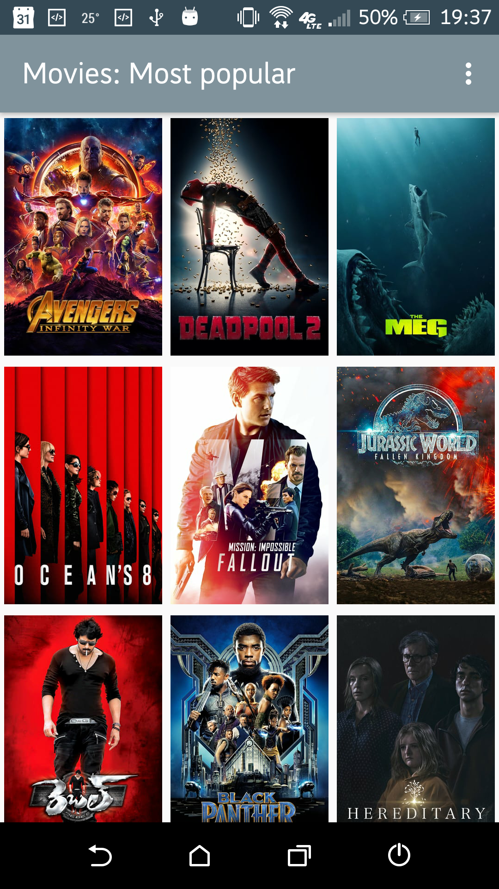
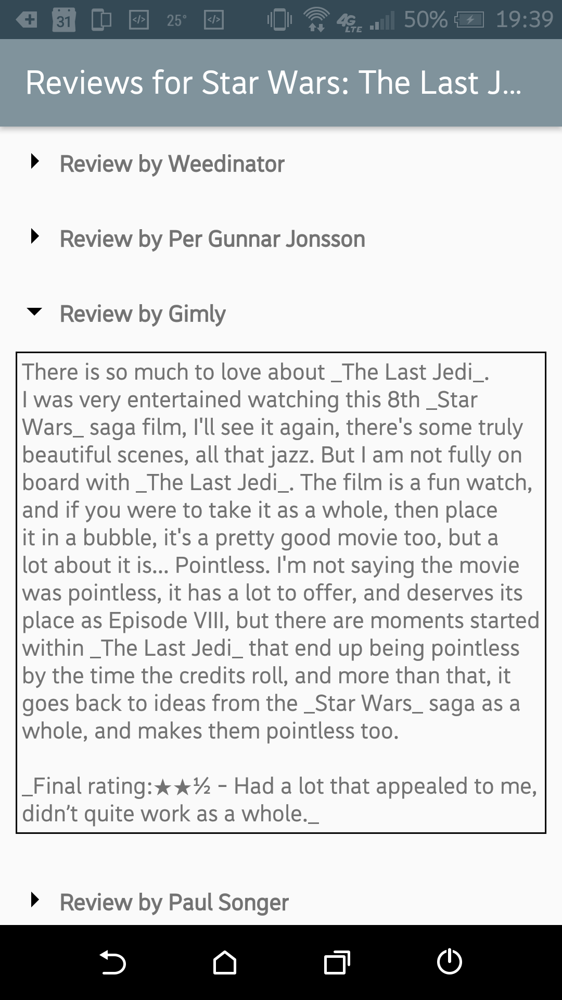

# Movies Project (Stage 2)

## Project overview
In this project, the **Movies** app shows a grid of movies sorted by either popularity, rating, or favorites.

Note: the app grabs only the first page of the results json file (~20 movies). The requirements did not mention whether more should be retrieved.

## Project details
The app will (by using themoviedb.org API):
* Upon launch, present the user with an grid arrangement of movie posters.
* Allow your user to change sort order via a setting:
    * The sort order can be by most popular, by top rated or favorites stored using Room.

* Allow the user to tap on a movie poster and transition to a details screen with additional information such as:
    * original title
    * movie poster image thumbnail
        * Picasso will be used for this
    * A plot synopsis (called overview in the api)
    * user rating (called vote_average in the api)
    * release date
    * carousel of trailers
    * list of reviews

## How was this project completed?
More details can be found here: [Popular Movies App Implementation Guide](https://docs.google.com/document/d/1ZlN1fUsCSKuInLECcJkslIqvpKlP7jWL2TP9m6UiA6I/pub?embedded=true#h.bmztf99oydcp)

## IMPORTANT notes about how to use the API key
Create file "keys.xml" in the 'values' folder and add the following key to it: 
`<?xml version="1.0" encoding="utf-8"?>` 
 &nbsp;&nbsp;`<resources>` 
     &nbsp;&nbsp;&nbsp;`<string name="moviedb_api_key">api_key_goes_here</string>` 
     &nbsp;&nbsp;&nbsp;`<string name="youtube_api_key">api_key_goes_here</string>` 
     &nbsp;&nbsp;&nbsp;`...` 
 `</resources>`

## Some screenshots:

## Potential improvements:
Endless scrolling

## Resources used:
* https://icons8.com/icon/set/not%20connected/material
* Stackoverflow when stuck with Retrofit, adapters, deserialization, etc.